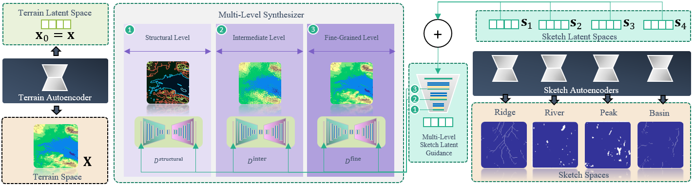
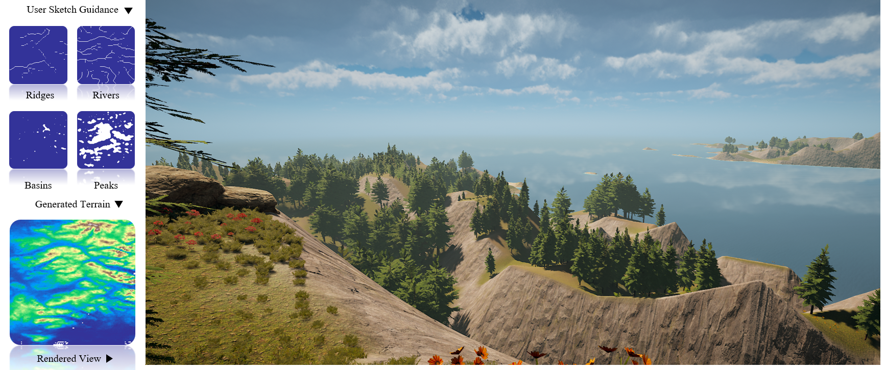
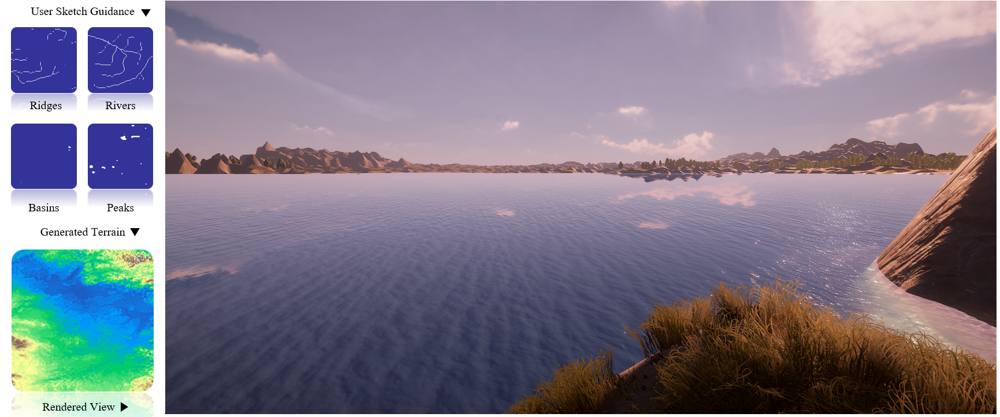
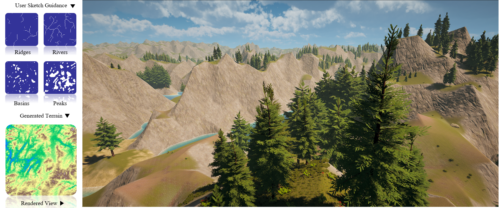

# TDN

[**Terrain Diffusion Network: Climatic-Aware Terrain Generation with Geological Sketch Guidance**]
[GitHub](https://github.com/TDNResearch/TDN)


[Terrain Diffusion Network](## Terrain Diffusion Network) is a sketch to terrain multi-denoiser diffusion model, which actively incorporates user guidance for enhanced
controllability, taking into account terrain features like rivers, ridges, basins, and peaks. Instead of adhering to a
conventional monolithic denoising process, which often compromises the fidelity of terrain details or the alignment with
user control, a multi-level denoising scheme is proposed to generate more realistic terrains by taking into account finegrained
details, particularly those related to climatic patterns influenced by erosion and tectonic activities.

  
## Set Up

```
conda create -n tdn python=3.9
conda activate tdn
conda install pytorch torchvision torchaudio pytorch-cuda=11.8 -c pytorch -c nvidia
pip install -r requirements.txt
```


## Terrain Diffusion Network

Current version of Terrain Diffusion Network consists of three level denoiser with a sketch encoder and a terrain encoder, showed as below



### Text-to-Image with Stable Diffusion





#### Inference Script

We provide a sample inference sampling script:

```
python test.py
 
```

## Todo

- [ ] Upload training dataset to google drive
- [ ] Upload model

## BibTeX

```
```